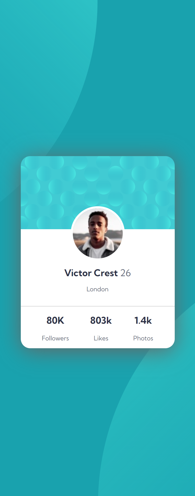

# Frontend Mentor - Profile card component solution

This is a solution to the [Profile card component challenge on Frontend Mentor](https://www.frontendmentor.io/challenges/profile-card-component-cfArpWshJ). 
## Table of contents

- [Overview](#overview)
  - [The challenge](#the-challenge)
  - [Screenshot](#screenshot)
  - [Links](#links)
  - [Built with](#built-with)
  - [What I learned](#what-i-learned)
- [Author](#author)
- [Acknowledgments](#acknowledgments)

## Overview
This is a profile card that is created using HTML & CSS. It uses CSS properties like flex and media queries which make it desktop as well as mobile responsive.
### The challenge

- Build out the project to the designs provided

### Screenshot

### Links

- Solution URL: [Add solution URL here](https://your-solution-url.com)
- Live Site URL: [Add live site URL here](https://your-live-site-url.com)

### Built with

- Semantic HTML5 markup
- CSS custom properties
- Flexbox
- CSS Grid
- Mobile-first workflow

### What I learned

By building this profile component I strengthened my concepts of CSS like flex and alignment.

## Author

- Website - [Amogh Nandodkar](https://amoghnandodkar.netlify.app/)
- Frontend Mentor - [@NandodkarAmogh](https://www.frontendmentor.io/profile/NandodkarAmogh)

